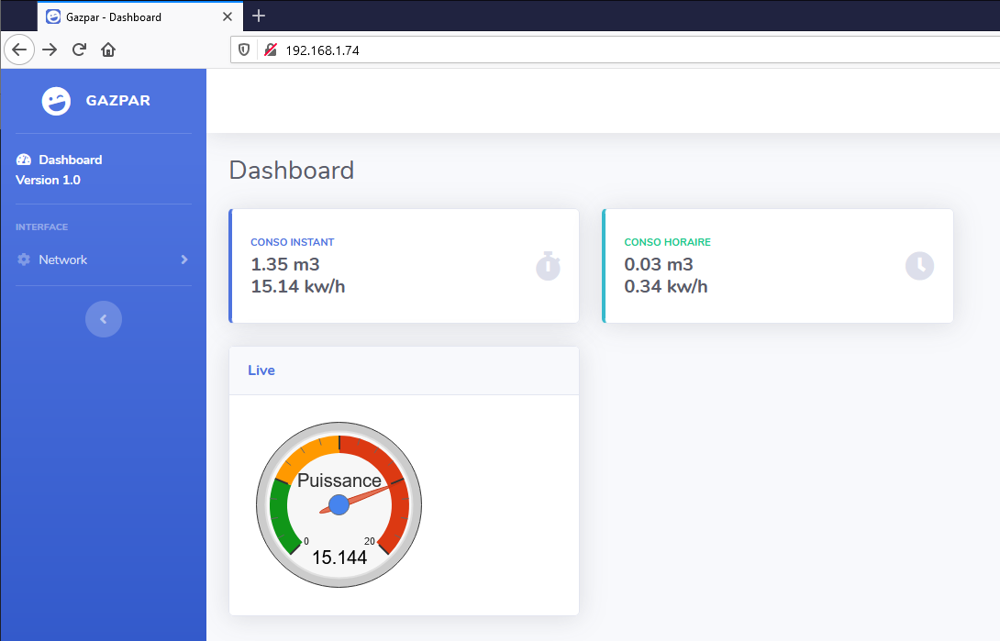

# Gazpar-Light

[](https://nodesource.com/products/nsolid)

In French because "Gazpar" is only in France.

Gazpar-Light à pour but de récupéré les informations sur le compteur communicant Gazpar. 
La version Light est minimaliste au possible, elle ne fait que remonter les informations vers Domoticz ( OK ) ou Jeedom ( non testé )
et fonctionne en mode DeepSleep et donc ne fonctionne que lors d'une impulsion du gazpar. 

La version full est avec un serveur Web intégré et utilise le SPDIFF, et remonte les informations vers Domoticz ( OK ) ou Jeedom ( non testé )

# Gazpar-Light fonctionne avec les différents ESP8266 classiques ( Wemos et Lolin testé )

il utilise les librairies suivante :
  - esp8266 
  - ESP8266WiFi
  - ESPAsyncWiFiManager
  - ESP8266HTTPClient
  - ArduinoOTA et WiFiUdp pour l'OTA sous Wemos ( mise à jour par Wifi )


# Gazpar-full 
utilise en plus  
  - ESPAsyncWebServer
  - ESPAsyncTCP
  - fs

et se présente sous l'aspect suivant :


# Montage électronique :

  - une résistance de 1 Kohms entre D1 et 3V
  - GND connecté à la borne 1 du Gazpar ( celle du bas )
  - D1 connecté à la borne 2 de Gazpar ( celle du haut )

# Configuration de Domoticz :

créer un nouveau capteur virtuel de type capteur incrémental. 
une fois créé relevez l'IDX pour la suite, et éditez votre capteur et changez le en type 'gaz'

# Configuration du programme :

Il faut définir si vous utilisez Jeedom ou Domoticz ( ici Domoticz dans l'exemple )

```sh
#define usejeedom 0
#define usedomoticz 1
```

entrer les informations du server de domotique  et l'IDX du capteur précédement créé

```sh
char* domotic_server = "192.168.xx.xx" ;
int   port     = 8080;
const char* apiKey   = "My API KEY";   /// for Jeedom
String IDX  = "xx" ;
```

et c'est tout. 
Le wifi sera configurable au 1er lancement de l'esp8266, un réseau Gazpar-Domotique va apparaitre sur le Wifi
une fois configuré, l'esp apparaitra sur votre réseau sous le nom de Gazpar-ESP8266. 

L'esp8266 envera l'information vers le serveur Domotique. ( step 0.01 m3 )

